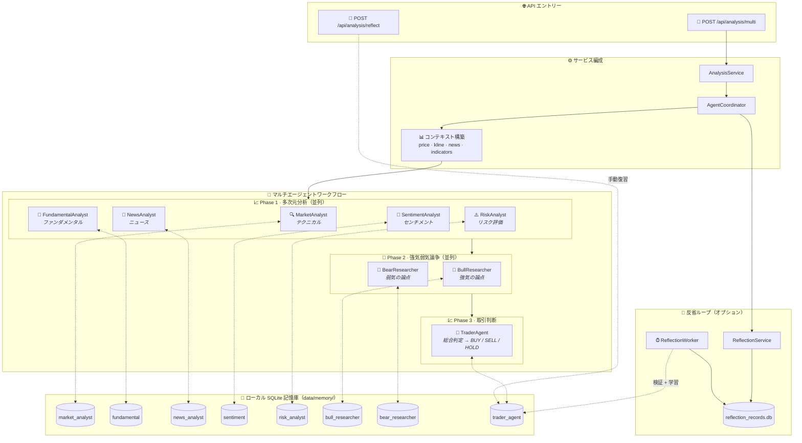

<div align="center">
  <a href="README.md">🇺🇸 English</a> |
  <a href="README_CN.md">🇨🇳 简体中文</a> |
  <a href="README_TW.md">🇹🇼 繁體中文</a> |
  <a href="README_JA.md">🇯🇵 日本語</a> |
  <a href="README_KO.md">🇰🇷 한국어</a>
</div>
<br/>

<div align="center">
  <a href="https://github.com/brokermr810/QuantDinger">
    
  </a>

  <h1 align="center">QuantDinger</h1>

  <h3 align="center">
    ローカルファーストの定量的取引インフラストラクチャ
  </h3>

  <p align="center">
    <strong>🔒 プライバシー重視 · 🛠️ セルフホスト · 📊 マルチマーケット</strong>
  </p>
  <p align="center">
    <i>独自の取引インフラストラクチャを実行：データ、分析、バックテスト、実行。</i>
  </p>

  <p align="center">
  <a href="https://www.quantdinger.com"><strong>公式コミュニティ</strong></a> ·
  <a href="https://ai.quantdinger.com"><strong>ライブデモ</strong></a> ·
  <a href="https://youtu.be/HPTVpqL7knM"><strong>📺 動画デモ</strong></a> ·
  <a href="CONTRIBUTORS.md"><strong>🌟 参加する</strong></a>
  </p>

  <p align="center">
    <a href="LICENSE"></a>
    
    
    
    
  </p>

  <p align="center">
    <a href="https://t.me/quantdinger"></a>
    <a href="https://discord.gg/vwJ8zxFh9Q"></a>
    <a href="https://x.com/HenryCryption"></a>
  </p>
</div>

---

## 📖 はじめに

### QuantDingerとは？

QuantDingerは **ローカルファースト、プライバシー重視の定量的取引インフラストラクチャ** です。完全にあなたのマシン上で実行され、戦略、取引データ、APIキーを完全にコントロールできます。

### なぜローカルファーストなのか？

データと戦略をクラウドにロックするSaaSプラットフォームとは異なり、QuantDingerはローカルで実行されます。あなたの戦略、取引ログ、APIキー、分析結果はすべてあなたのマシンに保存されます。ベンダーロックインなし、サブスクリプション費用なし、データ流出なし。

### 誰のためのものか？

QuantDingerは以下のユーザー向けに構築されています：
- データ主権とプライバシーを重視するトレーダー、研究者、エンジニア
- 透明で監査可能な取引インフラストラクチャを必要とする人
- マーケティングよりもエンジニアリングを好む人
- 完全なワークフローが必要な人：データ、分析、バックテスト、実行

### コア機能

QuantDingerには、ウェブから金融情報を収集し、ローカル市場データと組み合わせて分析レポートを生成する、内蔵の **LLMベースのマルチエージェント研究システム** が含まれています。これは戦略開発、バックテスト、実取引ワークフローと統合されています。

### コアバリュー

- **プライバシー第一**: すべての戦略、取引ログ、APIキーはローカルのSQLiteデータベースに保存されます
- **AI駆動の分析**: 市場分析のためのLLMベースの研究エージェント（OpenRouter/LLM）
- **マルチマーケットサポート**: 暗号資産、米国株、中国/香港株、FX、先物
- **Dockerデプロイ**: Docker Composeによるワンコマンドセットアップ

---

## 📺 動画デモ

<div align="center">
  <a href="https://youtu.be/HPTVpqL7knM">
    
  </a>
  <p><strong>上の動画をクリックしてQuantDingerプロジェクト紹介をご覧ください</strong></p>
</div>

---

## 📚 ドキュメント
- [Python 戦略開発ガイド](docs/STRATEGY_DEV_GUIDE_JA.md)

## 📸 ビジュアルツアー

<div align="center">
  <h3>📊 プロフェッショナル・クオンツダッシュボード</h3>
  <p>市場の動向、資産、戦略ステータスをリアルタイムで監視。</p>
  
</div>

<br/>

<table align="center" width="100%">
  <tr>
    <td width="50%" align="center" valign="top">
      <h3>🤖 AI ディープリサーチ</h3>
      <p>市場センチメントとテクニカル分析のためのマルチエージェント・コラボレーション。</p>
      
    </td>
    <td width="50%" align="center" valign="top">
      <h3>💬 スマートトレーディングアシスタント</h3>
      <p>即座に市場の洞察を得るための自然言語インターフェース。</p>
      
    </td>
  </tr>
  <tr>
    <td width="50%" align="center" valign="top">
      <h3>📈 インタラクティブなインジケーター分析</h3>
      <p>ドラッグ＆ドロップ分析を備えた豊富なテクニカルインジケーターライブラリ。</p>
      
    </td>
    <td width="50%" align="center" valign="top">
      <h3>🐍 Python 戦略生成</h3>
      <p>AI支援による戦略コーディングが可能な内蔵エディタ。</p>
      
    </td>
  </tr>
</table>

---

## ✨ 主な機能

### 1. ユニバーサルデータエンジン

QuantDingerは複数の市場にわたる統一されたデータインターフェースを提供します：

- **暗号資産**: 取引のための直接API接続（10以上の取引所）と、市場データのためのCCXT統合（100以上のソース）
- **株式**: Yahoo Finance、Finnhub、Tiingo（米国株）、AkShare（中国/香港株）
- **先物/FX**: OANDAおよび主要な先物データソース
- **プロキシサポート**: 制限されたネットワーク環境のための内蔵プロキシ設定

### 2. AI マルチエージェントリサーチ

システムには市場分析のためのマルチエージェントワークフローが含まれています：

- **コーディネーターエージェント**: タスク分解とワークフロー管理
- **リサーチエージェント**: マクロニュースとイベントのためのウェブ検索（Google/Bing）
- **市場固有エージェント**: 暗号資産と株式のためのテクニカル分析と資金フロー分析
- **レポート生成**: 構造化された日次/週次リサーチレポート

### 2.1 🧠 記憶拡張エージェント（Memory-Augmented Agents）
QuantDinger のエージェントは毎回「ゼロから」ではありません。バックエンドに **ローカル記憶DB + 反省（検証）ループ** を内蔵し、過去の経験を検索して system prompt に注入します（RAG 風）。

- **これは何か**：経験検索によるプロンプト拡張（※モデルの学習/微調整ではありません）
- **保存先**：ローカル SQLite（`backend_api_python/data/memory/`）

#### フロー図（リクエスト → 記憶閉ループ）



#### 検索ランキング（簡略）
\[
score = w_{sim}\cdot sim + w_{recency}\cdot recency + w_{returns}\cdot returns\_score
\]

#### 学習の入口
- **手動復習（推奨）**：`POST /api/analysis/reflect` で実際の結果（returns/result）を記憶へ
- **自動検証（任意）**：`ENABLE_REFLECTION_WORKER=true`、`REFLECTION_WORKER_INTERVAL_SEC` で定期検証→記憶へ反映

#### 主な環境変数（`.env`）
- `ENABLE_AGENT_MEMORY`, `AGENT_MEMORY_TOP_K`, `AGENT_MEMORY_CANDIDATE_LIMIT`
- `AGENT_MEMORY_ENABLE_VECTOR`, `AGENT_MEMORY_EMBEDDING_DIM`
- `AGENT_MEMORY_HALF_LIFE_DAYS`, `AGENT_MEMORY_W_SIM`, `AGENT_MEMORY_W_RECENCY`, `AGENT_MEMORY_W_RETURNS`
- `ENABLE_REFLECTION_WORKER`, `REFLECTION_WORKER_INTERVAL_SEC`

### 3. 戦略ランタイム

- **スレッドベースのエグゼキューター**: 戦略実行のための独立したスレッドプール
- **自動復元**: システム再起動後に実行中の戦略を再開
- **注文キュー**: 注文実行のためのバックグラウンドワーカー

### 4. 技術スタック

- **バックエンド**: Python (Flask) + SQLite + Redis（オプション）
- **フロントエンド**: Vue 2 + Ant Design Vue + KlineCharts/ECharts
- **デプロイ**: Docker Compose

---

## 🔌 対応取引所

QuantDingerは実行のための主要な暗号資産取引所への直接API接続をサポートし、広範な市場データカバレッジのためにCCXTを使用します。

### 直接APIサポート

| 取引所 | 市場 |
|:--------:|:---------|
| Binance | 現物, 先物, マージン |
| OKX | 現物, 無期限, オプション |
| Bitget | 現物, 先物, コピートレーディング |

### CCXT経由でもサポート

Bybit、Gate.io、Kraken、KuCoin、HTX、および100以上のその他の取引所が市場データ用にサポートされています。

---

### 多言語サポート

QuantDingerは、包括的な国際化対応により、世界中のユーザー向けに構築されています。

全てのUI要素、エラーメッセージ、ドキュメントは完全に翻訳されています。言語はブラウザの設定に基づいて自動検出されますが、アプリ内で手動で切り替えることも可能です。

---

### 対応市場

| 市場タイプ | データソース | 取引 |
|-------------|--------------|---------|
| **暗号資産** | Binance, OKX, Bitget, + 100 取引所 | ✅ 完全サポート |
| **米国株** | Yahoo Finance, Finnhub, Tiingo | ✅ ブローカーAPI経由 |
| **中国/香港株** | AkShare, East Money | ⚡ データのみ |
| **FX** | Finnhub, OANDA | ✅ ブローカーAPI経由 |
| **先物** | 取引所API, AkShare | ⚡ データのみ |

---

### アーキテクチャ (現在のリポジトリ)

```text
┌─────────────────────────────┐
│      quantdinger_vue         │
│   (Vue 2 + Ant Design Vue)   │
└──────────────┬──────────────┘
               │  HTTP (/api/*)
               ▼
┌─────────────────────────────┐
│     backend_api_python       │
│   (Flask + 戦略ランタイム)   │
└──────────────┬──────────────┘
               │
               ├─ SQLite (quantdinger.db)
               ├─ Redis (オプション キャッシュ)
               └─ データプロバイダー / LLMs / 取引所
```

---

### リポジトリ構造

```text
.
├─ backend_api_python/         # Flask API + AI + バックテスト + 戦略ランタイム
│  ├─ app/
│  ├─ env.example              # ローカル設定用に .env にコピー
│  ├─ requirements.txt
│  └─ run.py                   # エントリーポイント
└─ quantdinger_vue/            # Vue 2 UI (開発サーバーは /api をバックエンドにプロキシ)
```

---

## クイックスタート

### オプション 1: Docker デプロイ (推奨)

QuantDingerを実行する最速の方法です。

#### 1. ワンクリック起動

**Linux / macOS**
```bash
git clone https://github.com/brokermr810/QuantDinger.git && \
cd QuantDinger && \
cp backend_api_python/env.example backend_api_python/.env && \
docker-compose up -d --build
```

**Windows (PowerShell)**
```powershell
git clone https://github.com/brokermr810/QuantDinger.git
cd QuantDinger
Copy-Item backend_api_python\env.example -Destination backend_api_python\.env
docker-compose up -d --build
```

#### 2. アクセスと設定

- **フロントエンド UI**: http://localhost:8888
- **デフォルトアカウント**: `quantdinger` / `123456`

> **注意**: AI機能や本番環境のセキュリティのために、`backend_api_python/.env` を編集し（`OPENROUTER_API_KEY`の追加、パスワードの変更）、`docker-compose restart backend` でサービスを再起動してください。

#### 3. アプリケーションへのアクセス

- **フロントエンド UI**: http://localhost
- **バックエンド API**: http://localhost:5000

#### Docker コマンドリファレンス

```bash
# 実行状態の表示
docker-compose ps

# ログの表示
docker-compose logs -f

# サービスの停止
docker-compose down

# 停止してボリュームを削除 (警告: データベースが削除されます！)
docker-compose down -v
```

#### データの永続化

以下のデータはホストにマウントされ、コンテナの再起動後も保持されます：

```yaml
volumes:
  - ./backend_api_python/logs:/app/logs                       # ログ
  - ./backend_api_python/data:/app/data                       # データディレクトリ（quantdinger.db を含む）
  - ./backend_api_python/.env:/app/.env                       # 設定ファイル
```

---

### オプション 2: ローカル開発

**前提条件**
- Python 3.10+ (推奨)
- Node.js 16+ (推奨)

#### 1. バックエンドの起動 (Flask API)

```bash
cd backend_api_python
pip install -r requirements.txt
cp env.example .env   # Windows: copy env.example .env
python run.py
```

バックエンドは `http://localhost:5000` で利用可能になります。

#### 2. フロントエンドの起動 (Vue UI)

```bash
cd quantdinger_vue
npm install
npm run serve
```

フロントエンド開発サーバーは `http://localhost:8000` で実行され、`/api/*` を `http://localhost:5000` にプロキシします。

---

### 設定 (.env)

`backend_api_python/env.example` をテンプレートとして使用してください。一般的な設定：

- **認証**: `SECRET_KEY`, `ADMIN_USER`, `ADMIN_PASSWORD`
- **サーバー**: `PYTHON_API_HOST`, `PYTHON_API_PORT`, `PYTHON_API_DEBUG`
- **AI / LLM**: `OPENROUTER_API_KEY`, `OPENROUTER_MODEL`
- **ウェブ検索**: `SEARCH_PROVIDER`, `SEARCH_GOOGLE_*`, `SEARCH_BING_API_KEY`
- **プロキシ (オプション)**: `PROXY_PORT` または `PROXY_URL`

---

## 🤝 コミュニティとサポート

- **貢献**: [貢献ガイド](CONTRIBUTING.md) · [貢献者](CONTRIBUTORS.md)
- **Telegram**: [QuantDingerグループ](https://t.me/quantdinger)
- **Discord**: [サーバーに参加](https://discord.gg/vwJ8zxFh9Q)
- **📺 動画デモ**: [プロジェクト紹介](https://youtu.be/HPTVpqL7knM)
- **YouTube**: [@quantdinger](https://youtube.com/@quantdinger)
- **Email**: [brokermr810@gmail.com](mailto:brokermr810@gmail.com)
- **GitHub Issues**: [バグ報告 / 機能リクエスト](https://github.com/brokermr810/QuantDinger/issues)

---

## 💰 プロジェクトの持続可能性

QuantDingerはオープンソースで無料で使用できます。有用だと思われる場合は、以下が継続的な開発を支援する方法です：

### 直接寄付

**ERC-20 / BEP-20 / Polygon / Arbitrum**
```
0x96fa4962181bea077f8c7240efe46afbe73641a7
```


### 取引所紹介リンク

サポートされている取引所に登録する場合、以下のリンクを使用すると紹介特典が提供され、プロジェクトの支援に役立ちます。これらはオプションであり、取引手数料やアカウント機能には影響しません。

| 取引所 | 紹介リンク |
|:--------:|:-------------|
| Binance | [紹介リンクで登録](https://www.bmwweb.ac/referral/earn-together/refer2earn-usdc/claim?hl=zh-CN&ref=GRO_28502_9OSOJ) |
| OKX | [紹介リンクで登録](https://www.bjwebptyiou.com/join/14449926) |
| Bitget | [紹介リンクで登録](https://share.glassgs.com/u/H8XZGS71) |

---

### 商用サービス

以下のプロフェッショナルサービスを提供しています：

| サービス | 説明 |
|---------|-------------|
| **デプロイ & セットアップ** | サーバーのデプロイ、設定、最適化に関するマンツーマンのサポート |
| **カスタム戦略開発** | 特定のニーズや市場に合わせて設計された取引戦略の開発 |
| **エンタープライズアップグレード** | 商用ライセンス、優先サポート、ビジネス向けの高度な機能 |
| **トレーニング & コンサルティング** | 取引チーム向けの実践的なトレーニングセッションと戦略コンサルティング |

**ご興味がありますか？** 以下よりお問い合わせください：
- 📧 Email: [brokermr810@gmail.com](mailto:brokermr810@gmail.com)
- 💬 Telegram: [QuantDinger Group](https://t.me/quantdinger)

---

### 謝辞

QuantDingerは、Flask, Pandas, CCXT, Vue.js, Ant Design Vue, KlineChartsなどの素晴らしいオープンソースプロジェクトの上に成り立っています。

すべてのメンテナとコントリビューターに感謝します！ ❤️

