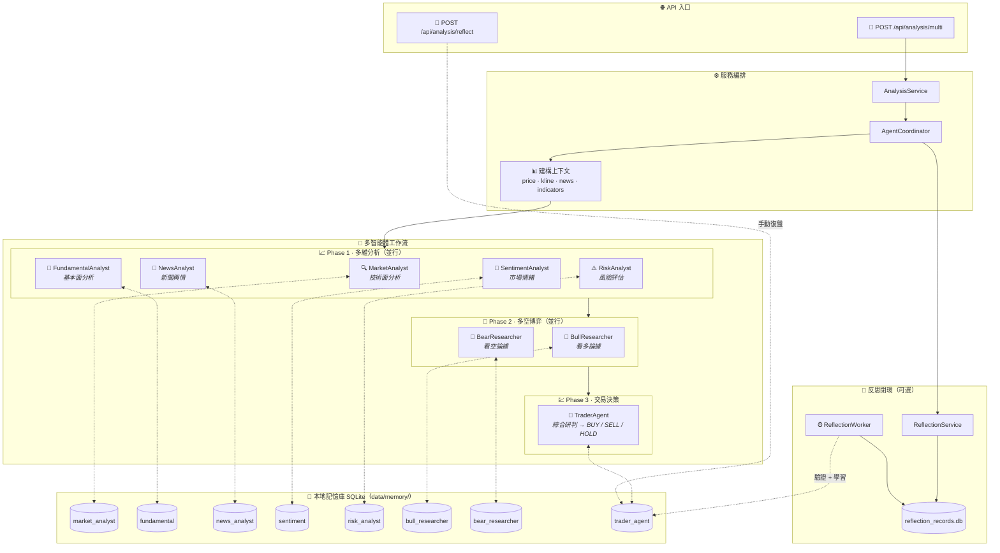

<div align="center">
  <a href="README.md">🇺🇸 English</a> |
  <a href="README_CN.md">🇨🇳 简体中文</a> |
  <a href="README_TW.md">🇹🇼 繁體中文</a> |
  <a href="README_JA.md">🇯🇵 日本語</a> |
  <a href="README_KO.md">🇰🇷 한국어</a>
</div>
<br/>

<div align="center">
  <a href="https://github.com/brokermr810/QuantDinger">
    
  </a>

  <h1 align="center">QuantDinger</h1>

  <h3 align="center">
    本地優先的量化交易基礎設施
  </h3>

  <p align="center">
    <strong>🔒 隱私優先 · 🛠️ 自託管 · 📊 多市場</strong>
  </p>
  <p align="center">
    <i>運行你自己的交易基礎設施：數據、分析、回測和執行。</i>
  </p>

  <p align="center">
  <a href="https://www.quantdinger.com"><strong>官方社區</strong></a> ·
  <a href="https://ai.quantdinger.com"><strong>在線演示</strong></a> ·
  <a href="https://youtu.be/HPTVpqL7knM"><strong>📺 視頻演示</strong></a> ·
  <a href="CONTRIBUTORS.md"><strong>🌟 加入我們</strong></a>
  </p>

  <p align="center">
    <a href="LICENSE"></a>
    
    
    
    
  </p>

  <p align="center">
    <a href="https://t.me/quantdinger"></a>
    <a href="https://discord.gg/vwJ8zxFh9Q"></a>
    <a href="https://x.com/HenryCryption"></a>
  </p>
</div>

---

## 📖 簡介

### QuantDinger 是什麼？

QuantDinger 是一個**本地優先、隱私優先的量化交易基礎設施**。它完全運行在你的機器上，讓你完全控制自己的策略、交易數據和 API 密鑰。

### 為什麼選擇本地優先？

與將你的數據和策略鎖定在雲端的 SaaS 平台不同，QuantDinger 在本地運行。你的策略、交易日誌、API 密鑰和分析結果都保留在你的機器上。沒有供應商鎖定，沒有訂閱費用，沒有數據洩露風險。

### 適合誰使用？

QuantDinger 為以下用戶而構建：
- 重視數據主權和隱私的交易員、研究員和工程師
- 需要透明、可審計的交易基礎設施
- 更偏好工程而非營銷
- 需要完整的工作流：數據、分析、回測和執行

### 核心功能

QuantDinger 包含一個內置的**基於 LLM 的多智能體研究系統**，能夠從網絡收集金融情報，結合本地市場數據，生成分析報告。這與策略開發、回測和實盤交易工作流無縫集成。

### 核心價值

- **隱私優先**：所有策略、交易日誌和 API 密鑰都存儲在本地 SQLite 數據庫中
- **AI 驅動的分析**：基於 LLM 的研究智能體（OpenRouter/LLM）進行市場分析
- **多市場支持**：加密貨幣、美股、A股/港股、外匯和期貨
- **Docker 部署**：使用 Docker Compose 一鍵部署

---

## 📺 視頻演示

<div align="center">
  <a href="https://youtu.be/HPTVpqL7knM">
    
  </a>
  <p><strong>點擊上方視頻觀看 QuantDinger 專案介紹</strong></p>
</div>

---

## 📚 文檔
- [Python 策略開發指南](docs/STRATEGY_DEV_GUIDE_TW.md)

## 📸 功能預覽

<div align="center">
  <h3>📊 專業量化儀表盤</h3>
  <p>實時監控市場動態、資產狀況和策略狀態。</p>
  
</div>

<br/>

<table align="center" width="100%">
  <tr>
    <td width="50%" align="center" valign="top">
      <h3>🤖 AI 深度投研</h3>
      <p>多智能體協作進行市場情緒與技術分析。</p>
      
    </td>
    <td width="50%" align="center" valign="top">
      <h3>💬 智能交易助手</h3>
      <p>通過自然語言接口獲取即時市場洞察。</p>
      
    </td>
  </tr>
  <tr>
    <td width="50%" align="center" valign="top">
      <h3>📈 交互式指標分析</h3>
      <p>豐富的技術指標庫，支持拖拽式分析。</p>
      
    </td>
    <td width="50%" align="center" valign="top">
      <h3>🐍 Python 策略生成</h3>
      <p>內置編輯器，支持 AI 輔助策略代碼編寫。</p>
      
    </td>
  </tr>
</table>

---

## ✨ 關鍵特性

### 1. 通用數據引擎
無需再為數據 API 發愁。QuantDinger 採用了強大的數據源工廠模式：
- **加密貨幣**：**直連交易所 API** 進行交易（支持 10+ 交易所），結合 **CCXT** 獲取行情數據（支持 100+ 來源）。
- **股票**：集成 Yahoo Finance、Finnhub、Tiingo (美股) 和 AkShare (A股/港股)。
- **期貨/外匯**：支持 OANDA 及主要期貨數據源。
- **代理支持**：內置代理配置，適應受限網絡環境。

### 2. AI 多智能體投研
你不知疲倦的分析師團隊：
- **協調智能體**：拆解任務並管理工作流。
- **搜索智能體**：進行全網搜索（Google/Bing）獲取宏觀新聞。
- **加密/股票智能體**：專注於特定市場的技術和資金流向分析。
- **報告生成**：自動產出結構化的日報/週報。

### 2.1 🧠 AI 記憶增強系統（Memory-Augmented Agents）
QuantDinger 的多智能體不是「每次從零開始」。後端內建**本地記憶庫 + 反思閉環**：在生成提示詞（prompt）時檢索過往經驗並注入到 system prompt，並可在事後驗證/復盤後把結果寫回記憶庫。

- **本質**：RAG 風格「經驗檢索增強」，**不是**訓練/微調模型權重（零外部向量庫依賴）。
- **隱私**：所有記憶與反思記錄預設落盤在本地 SQLite：`backend_api_python/data/memory/`。

#### 邏輯圖（從請求到記憶閉環）



#### 檢索排序（簡化）
\[
score = w_{sim}\cdot sim + w_{recency}\cdot recency + w_{returns}\cdot returns\_score
\]

#### 兩條「學習」通道
- **手動復盤（推薦）**：`POST /api/analysis/reflect` 寫入真實交易結果（returns/result）
- **自動反思（可選）**：`ENABLE_REFLECTION_WORKER=true` 後，背景任務按 `REFLECTION_WORKER_INTERVAL_SEC` 驗證到期記錄並寫回記憶

#### 关键環境變量（`.env`）
- `ENABLE_AGENT_MEMORY`, `AGENT_MEMORY_TOP_K`, `AGENT_MEMORY_CANDIDATE_LIMIT`
- `AGENT_MEMORY_ENABLE_VECTOR`, `AGENT_MEMORY_EMBEDDING_DIM`
- `AGENT_MEMORY_HALF_LIFE_DAYS`, `AGENT_MEMORY_W_SIM`, `AGENT_MEMORY_W_RECENCY`, `AGENT_MEMORY_W_RETURNS`
- `ENABLE_REFLECTION_WORKER`, `REFLECTION_WORKER_INTERVAL_SEC`

### 3. 策略運行時

- **基於線程的執行器**：獨立的線程池用於策略執行
- **自動恢復**：系統重啟後恢復運行中的策略
- **訂單隊列**：後台工作線程用於訂單執行

### 4. 技術棧

- **後端**：Python (Flask) + SQLite + Redis（可選）
- **前端**：Vue 2 + Ant Design Vue + KlineCharts/ECharts
- **部署**：Docker Compose

---

## 🔌 支持的交易所

QuantDinger 支持直接 API 連接到主要加密貨幣交易所進行執行，並使用 CCXT 獲取廣泛的行情數據。

### 直接 API 支持

| 交易所 | 市場 |
|:--------:|:---------|
| Binance | 現貨, 合約, 槓桿 |
| OKX | 現貨, 永續, 期權 |
| Bitget | 現貨, 合約, 跟單交易 |

### 也支持通過 CCXT

Bybit、Gate.io、Kraken、KuCoin、HTX 以及 100+ 其他交易所用於行情數據。


---

### 多語言支持

QuantDinger 為全球用戶構建，提供全面的國際化支持：

<p>
  
  
  
  
  
  
  
  
  
  
</p>

所有 UI 元素、錯誤信息和文檔均已完全翻譯。語言會根據瀏覽器設置自動檢測，也可以在應用中手動切換。

---

### 支持的市場

| 市場類型 | 數據源 | 交易 |
|-------------|--------------|---------|
| **加密貨幣** | Binance, OKX, Bitget, + 100 交易所 | ✅ 全面支持 |
| **美股** | Yahoo Finance, Finnhub, Tiingo | ✅ 通過券商 API |
| **A股/港股** | AkShare, 東方財富 | ⚡ 僅數據 |
| **外匯** | Finnhub, OANDA | ✅ 通過券商 API |
| **期貨** | 交易所 API, AkShare | ⚡ 僅數據 |

---

### 架構 (當前倉庫)

```text
┌─────────────────────────────┐
│      quantdinger_vue         │
│   (Vue 2 + Ant Design Vue)   │
└──────────────┬──────────────┘
               │  HTTP (/api/*)
               ▼
┌─────────────────────────────┐
│     backend_api_python       │
│   (Flask + 策略運行時)       │
└──────────────┬──────────────┘
               │
               ├─ SQLite (quantdinger.db)
               ├─ Redis (可選緩存)
               └─ 數據提供商 / LLMs / 交易所
```

---

### 倉庫目錄結構

```text
.
├─ backend_api_python/         # Flask API + AI + 回測 + 策略運行時
│  ├─ app/
│  ├─ env.example              # 複製為 .env 進行本地配置
│  ├─ requirements.txt
│  └─ run.py                   # 入口點
└─ quantdinger_vue/            # Vue 2 UI (開發服務器代理 /api -> 後端)
```

---

## 快速開始

### 選項 1: Docker 部署 (推薦)

運行 QuantDinger 最快的方式。

#### 1. 一鍵啟動

**Linux / macOS**
```bash
git clone https://github.com/brokermr810/QuantDinger.git && \
cd QuantDinger && \
cp backend_api_python/env.example backend_api_python/.env && \
docker-compose up -d --build
```

**Windows (PowerShell)**
```powershell
git clone https://github.com/brokermr810/QuantDinger.git
cd QuantDinger
Copy-Item backend_api_python\env.example -Destination backend_api_python\.env
docker-compose up -d --build
```

#### 2. 訪問與配置

- **前端 UI**: http://localhost:8888
- **默認賬號**: `quantdinger` / `123456`

> **注意**：為了使用 AI 功能或生產環境安全，請編輯 `backend_api_python/.env`（添加 `OPENROUTER_API_KEY`，修改密碼），然後執行 `docker-compose restart backend` 重啟服務。

#### 3. 訪問應用

- **前端 UI**: http://localhost
- **後端 API**: http://localhost:5000

#### Docker 命令參考

```bash
# 查看運行狀態
docker-compose ps

# 查看日誌
docker-compose logs -f

# 停止服務
docker-compose down

# 停止並刪除卷 (警告：會刪除數據庫！)
docker-compose down -v
```

#### 數據持久化

以下數據掛載到主機，重啟容器後依然保留：

```yaml
volumes:
  - ./backend_api_python/logs:/app/logs                       # 日誌
  - ./backend_api_python/data:/app/data                       # 數據目錄（包含 quantdinger.db）
  - ./backend_api_python/.env:/app/.env                       # 配置文件
```

---

### 選項 2: 本地開發

**先決條件**
- 推薦 Python 3.10+
- 推薦 Node.js 16+

#### 1. 啟動後端 (Flask API)

```bash
cd backend_api_python
pip install -r requirements.txt
cp env.example .env   # Windows: copy env.example .env
python run.py
```

後端將在 `http://localhost:5000` 上可用。

#### 2. 啟動前端 (Vue UI)

```bash
cd quantdinger_vue
npm install
npm run serve
```

前端開發服務器運行在 `http://localhost:8000` 並將 `/api/*` 代理到 `http://localhost:5000`。

---

### 配置 (.env)

使用 `backend_api_python/env.example` 作為模板。常用設置包括：

- **認證**: `SECRET_KEY`, `ADMIN_USER`, `ADMIN_PASSWORD`
- **服務器**: `PYTHON_API_HOST`, `PYTHON_API_PORT`, `PYTHON_API_DEBUG`
- **AI / LLM**: `OPENROUTER_API_KEY`, `OPENROUTER_MODEL`
- **網絡搜索**: `SEARCH_PROVIDER`, `SEARCH_GOOGLE_*`, `SEARCH_BING_API_KEY`
- **代理 (可選)**: `PROXY_PORT` 或 `PROXY_URL`

---

## 🤝 社區與支持

- **貢獻**: [貢獻指南](CONTRIBUTING.md) · [貢獻者](CONTRIBUTORS.md)
- **Telegram**: [QuantDinger 群組](https://t.me/quantdinger)
- **Discord**: [加入服務器](https://discord.gg/vwJ8zxFh9Q)
- **📺 視頻演示**: [專案介紹](https://youtu.be/HPTVpqL7knM)
- **YouTube**: [@quantdinger](https://youtube.com/@quantdinger)
- **Email**: [brokermr810@gmail.com](mailto:brokermr810@gmail.com)
- **GitHub Issues**: [報告 Bug / 功能請求](https://github.com/brokermr810/QuantDinger/issues)

---

## 💰 專案可持續性

QuantDinger 是開源且免費使用的。如果你覺得它有用，以下是一些支持專案持續發展的方式：

### 直接捐贈

**ERC-20 / BEP-20 / Polygon / Arbitrum**
```
0x96fa4962181bea077f8c7240efe46afbe73641a7
```


### 交易所推薦鏈接

如果你正在註冊支持的交易所，使用下面的鏈接可以提供推薦收益，幫助支持專案。這些是可選的，不會影響你的交易費用或賬戶功能。

| 交易所 | 推薦鏈接 |
|:--------:|:-------------|
| Binance | [使用推薦鏈接註冊](https://www.bmwweb.ac/referral/earn-together/refer2earn-usdc/claim?hl=zh-CN&ref=GRO_28502_9OSOJ) |
| OKX | [使用推薦鏈接註冊](https://www.bjwebptyiou.com/join/14449926) |
| Bitget | [使用推薦鏈接註冊](https://share.glassgs.com/u/H8XZGS71) |

---

### 商業服務

我們提供專業服務，助你充分利用 QuantDinger：

| 服務 | 描述 |
|---------|-------------|
| **部署與設置** | 一對一協助服務器部署、配置和優化 |
| **定制策略開發** | 針對特定需求和市場定制交易策略 |
| **企業版升級** | 商業授權、優先支持和企業級高級功能 |
| **培訓與咨詢** | 為你的交易團隊提供實戰培訓和戰略咨詢 |

**感興趣？** 聯繫我們：
- 📧 Email: [brokermr810@gmail.com](mailto:brokermr810@gmail.com)
- 💬 Telegram: [QuantDinger Group](https://t.me/quantdinger)

---

### 致謝

QuantDinger 站在這些偉大的開源項目肩膀之上：Flask, Pandas, CCXT, Vue.js, Ant Design Vue, KlineCharts 等。

感謝所有維護者和貢獻者！ ❤️

